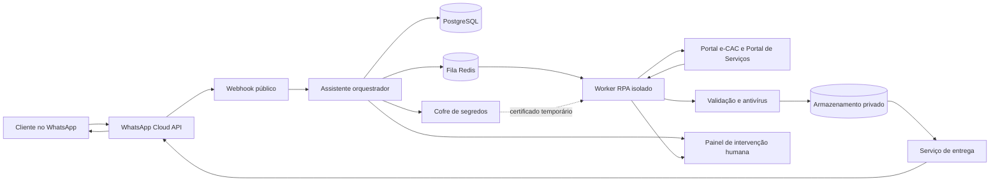
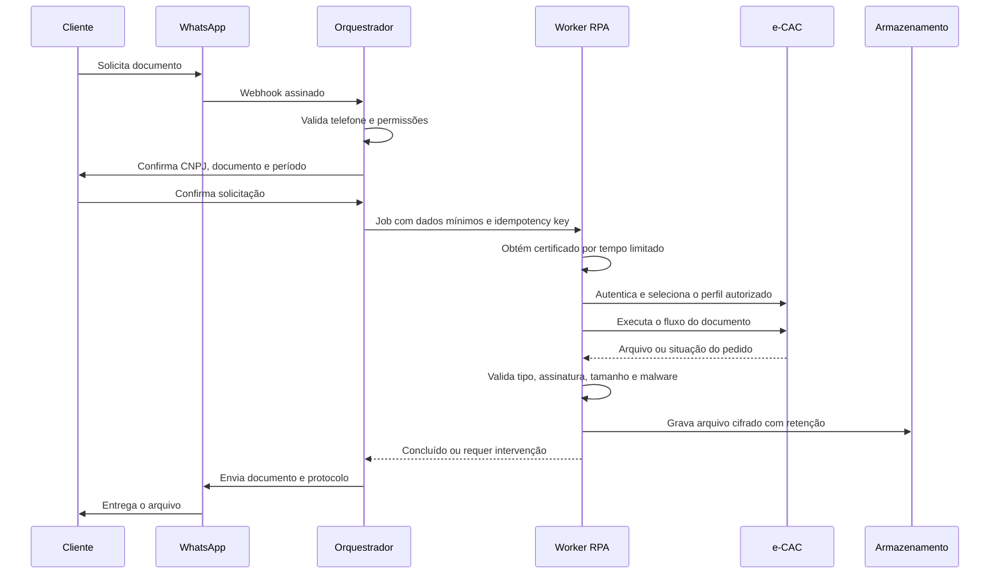

# Arquitetura do agente RPA para WhatsApp e e-CAC

## Objetivo

Construir um assistente no WhatsApp que identifique a solicitação do cliente, confirme empresa, documento e período, execute um fluxo autorizado no e-CAC por RPA e devolva o arquivo no próprio WhatsApp. O sistema deve operar com rastreabilidade, isolamento por cliente e proteção especial do certificado digital e dos documentos fiscais.

O agente de IA interpreta a conversa e produz uma solicitação estruturada. Ele não controla o navegador diretamente. A execução no e-CAC fica em fluxos determinísticos, versionados e auditáveis.

## Premissas do MVP

- WhatsApp Business Platform Cloud API oficial da Meta.
- Certificado ICP-Brasil A1 em arquivo PFX ou P12. Certificados A3 físicos, em token ou cartão, não são adequados à execução autônoma em um servidor remoto.
- Uma empresa atendida por execução, selecionada pelo CNPJ e pelas procurações ou autorizações disponíveis.
- Um catálogo inicial pequeno de documentos do e-CAC. Cada documento terá um fluxo RPA próprio.
- Nenhum certificado, senha ou código de autenticação será recebido pelo WhatsApp.
- CAPTCHA, autenticação adicional ou alteração relevante do portal interromperá o robô e criará uma tarefa de intervenção humana. O sistema não tentará contornar controles de segurança.

## Visão geral



## Fluxo da solicitação



## Componentes

### Gateway do WhatsApp

Recebe webhooks da Meta, valida a assinatura da requisição, rejeita eventos repetidos e grava o evento antes de responder. O endpoint deve responder rapidamente e delegar o processamento para a fila. O envio de PDFs será feito como mensagem do tipo documento, usando mídia previamente enviada à Meta ou uma URL temporária.

Fora da janela de atendimento aberta pelo usuário, o sistema deve usar um modelo de mensagem previamente aprovado pela Meta. O identificador da mensagem será guardado para acompanhar entrega, leitura e falha.

### Assistente orquestrador

O orquestrador mantém o estado da conversa e transforma linguagem natural em um comando com esquema fixo:

```json
{
  "tenant_id": "fs",
  "requester_id": "contato_autorizado",
  "company_cnpj": "00000000000000",
  "document_type": "documento_catalogado",
  "period": "AAAA-MM",
  "delivery_channel": "whatsapp",
  "confirmed": true
}
```

Antes de criar o job, ele valida o telefone, as empresas que o contato pode consultar, o tipo de documento, o período e a confirmação expressa. O modelo de IA poderá classificar a intenção e redigir respostas, mas não poderá inventar CNPJ, período, permissões ou ações no portal.

### Motor de workflows

Cada solicitação recebe uma chave de idempotência para impedir downloads e envios duplicados. A máquina de estados recomendada é:

`recebida → aguardando_dados → aguardando_confirmação → na_fila → acessando_portal → baixando → validando → enviando → concluída`

Estados de exceção: `aguardando_intervenção`, `sem_autorização`, `documento_indisponível`, `certificado_inválido`, `portal_indisponível` e `falha_definitiva`.

Para o MVP, BullMQ e Redis são suficientes. Se houver fluxos longos, espera por emissão de documento ou alto volume, o motor poderá migrar para Temporal sem alterar a interface do orquestrador.

### Worker RPA

O worker deve usar Playwright com navegador e perfil temporários. Cada job roda em um contêiner exclusivo, sem porta pública, com limite de CPU, memória e tempo. O worker recebe somente identificadores; busca os segredos no cofre usando uma credencial de curta duração.

O adaptador do e-CAC deve ter estas camadas:

- autenticação por certificado;
- seleção do perfil e do CNPJ representado;
- navegação para o serviço;
- preenchimento de filtros;
- download e validação do documento;
- captura de evidências em caso de erro;
- classificação de erros por motivo recuperável ou definitivo.

Os seletores devem priorizar papéis acessíveis, rótulos e textos estáveis. O fluxo deve confirmar página, CNPJ representado e tipo de documento antes de clicar em qualquer ação. Capturas de tela de falhas terão retenção curta e acesso restrito.

### Certificado digital

Para operação autônoma, o caminho recomendado é certificado A1 PFX ou P12. Playwright suporta certificado de cliente em contexto de navegador com arquivo PFX e senha, mas o login completo do e-CAC deve ser validado em uma prova técnica porque o portal pode atravessar diferentes origens e telas do gov.br.

O certificado ficará cifrado com chave exclusiva por cliente. A senha ficará separada do arquivo. Durante um job, ambos serão liberados somente ao worker autorizado, montados em memória ou volume temporário e eliminados ao encerrar o navegador. O sistema registrará uso, data, job, operador e CNPJ, sem registrar a senha ou o conteúdo da chave privada.

Regras obrigatórias:

- certificado e senha nunca trafegam pelo WhatsApp;
- acesso apenas por identidade de serviço e política de menor privilégio;
- rotação do segredo e bloqueio automático na expiração;
- procurações e serviços autorizados cadastrados por CNPJ;
- revogação imediata quando o cliente encerrar a autorização;
- uma sessão de navegador por cliente e por job, sem reaproveitar cookies entre empresas.

### Armazenamento de documentos

Os arquivos serão guardados em bucket privado, com acesso público desativado, chaves separadas por ambiente e links temporários de poucos minutos apenas para entrega. O banco guarda metadados; o arquivo fica no armazenamento de objetos.

Metadados mínimos: tenant, CNPJ, solicitante, tipo, competência, hash SHA-256, origem, data de obtenção, prazo de retenção, job e identificador da mensagem no WhatsApp.

Antes da entrega, o sistema confere MIME real, extensão, tamanho, hash e malware. O nome enviado ao cliente deve seguir um padrão como `CNPJ_TIPO_AAAA-MM.pdf`. A retenção sugerida para o MVP é de 30 dias, configurável pela FS, com exclusão automática e registro da exclusão.

## Implantação na Contabo

### MVP

Um VDS ou VPS com no mínimo 6 vCPU, 16 GB de RAM e disco NVMe atende o primeiro cliente e uma ou duas execuções simultâneas. O navegador consome memória e não deve compartilhar os mesmos limites do banco.

Serviços em Docker Compose:

- Caddy ou Traefik para TLS e proxy reverso;
- API e webhook;
- orquestrador;
- PostgreSQL;
- Redis;
- um ou dois workers RPA;
- cofre de segredos;
- ClamAV;
- agente de métricas e logs.

### Produção

A evolução recomendada separa o plano de controle do navegador:

- nó 1: proxy, API, orquestrador, PostgreSQL e Redis;
- nó 2: workers RPA sem tráfego de entrada;
- armazenamento de objetos privado;
- backup cifrado em região ou provedor distinto;
- comunicação interna por WireGuard;
- firewall permitindo apenas 80/443 no proxy e SSH por VPN ou lista de IPs.

O worker terá saída de rede restrita aos domínios da Receita Federal, gov.br, autoridade certificadora e serviços operacionais necessários. O painel administrativo exigirá MFA.

## Segurança e LGPD

A FS será a controladora dos dados dos seus clientes e a NEXA atuará como operadora conforme instruções documentadas. O sistema terá trilha de auditoria imutável, segregação por tenant, criptografia em trânsito e repouso, menor privilégio, política de retenção e procedimento de incidente.

A Contabo não lista região brasileira em sua oferta atual. Hospedar o processamento fora do Brasil caracteriza um ponto de transferência internacional a ser validado juridicamente. Antes da produção, devem ser definidos região, contrato de tratamento de dados, mecanismo previsto pela ANPD e quais dados realmente precisam persistir no exterior. Uma alternativa é usar a Contabo para o plano de controle e manter documentos em armazenamento localizado no Brasil, embora o tráfego temporário do RPA também precise ser analisado.

## Dados principais

- `tenants`: FS e futuras empresas atendidas.
- `contacts`: telefone, nome, status e vínculo com tenant.
- `contact_permissions`: CNPJs e documentos permitidos por contato.
- `companies`: CNPJ e perfil de acesso.
- `certificates`: referência ao cofre, validade e status; nunca o segredo em texto.
- `portal_authorizations`: procurações, serviços e validade.
- `conversations`: estado e janela de atendimento do WhatsApp.
- `requests`: documento, período, confirmação e estado.
- `jobs`: tentativas, erros, worker e idempotência.
- `documents`: metadados, hash, objeto e expiração.
- `audit_events`: ator, ação, horário, origem e resultado.

## Observabilidade e recuperação

Métricas essenciais: solicitações recebidas, tempo por etapa, sucesso por fluxo, falhas de login, expiração de certificados, indisponibilidade do portal, tamanho da fila e falhas de entrega no WhatsApp.

Alertas devem ser enviados para certificado próximo do vencimento, três falhas consecutivas do mesmo fluxo, aumento de mudanças de tela, fila parada, disco acima de 80%, backup ausente e documento não entregue.

Cada etapa pode repetir somente quando for segura. Downloads e mensagens utilizam idempotência. Após duas tentativas com o mesmo erro de tela, o job vai para intervenção humana, com URL interna para retomar a sessão ou revisar a evidência.

## Escopo recomendado para a primeira semana

1. Configurar WhatsApp Cloud API, webhook e número de teste.
2. Cadastrar um contato autorizado, um CNPJ e um certificado A1.
3. Implementar conversa estruturada para um único tipo de documento e período.
4. Executar login, seleção de perfil, download e validação pelo RPA.
5. Enviar o PDF no WhatsApp e registrar o protocolo.
6. Criar tela mínima de jobs, erros e intervenção humana.
7. Testar certificado expirado, procuração ausente, portal fora do ar, documento inexistente e envio duplicado.

O MVP estará validado quando um contato autorizado solicitar o documento, confirmar os dados, receber o PDF correto e toda a execução aparecer na auditoria sem exposição do certificado.

## Evolução até um mês

- ampliar o catálogo de documentos;
- painel operacional da FS;
- gestão de contatos, CNPJs, procurações e certificados;
- reprocessamento controlado e intervenção humana;
- relatórios de SLA e volumes;
- política automática de retenção;
- backup e restauração testados;
- homologação de segurança e carga;
- documentação operacional e treinamento.

## Decisões que precisam ser fechadas antes da prova técnica

1. Tipo do certificado disponível: A1 PFX/P12, A3 em nuvem ou A3 físico.
2. Primeiro documento exato a ser obtido no e-CAC e seus filtros.
3. Se a FS acessará clientes por procuração digital ou por certificado de cada empresa.
4. Lista de telefones autorizados e regra para confirmar o CNPJ solicitado.
5. Prazo de retenção dos documentos e região de hospedagem.
6. Quantidade estimada de solicitações diárias e simultâneas.

## Referências técnicas

- Receita Federal, acesso aos serviços digitais e perfis: https://www.gov.br/receitafederal/pt-br/acesso-a-informacao/perguntas-frequentes/servicos-digitais/servicos-digitais/acesso/como-acessar
- Receita Federal, procurações e autorizações de acesso: https://www.gov.br/receitafederal/pt-br/assuntos/procuracoes
- Playwright, certificados de cliente: https://playwright.dev/docs/api/class-browsertype
- Meta, coleção oficial da WhatsApp Cloud API: https://www.postman.com/meta/whatsapp-business-platform/documentation/wlk6lh4/whatsapp-cloud-api
- WhatsApp Business Policy: https://whatsappbusiness.com/policy/
- Contabo, regiões: https://contabo.com/en/locations/
- Contabo, armazenamento compatível com S3: https://help.contabo.com/en/support/solutions/articles/103000411092-object-storage-s3-compatibility-protocols-and-connection-settings
- ANPD, transferência internacional de dados: https://www.gov.br/anpd/pt-br/assuntos/assuntos-internacionais/transferencia-internacional-de-dados
