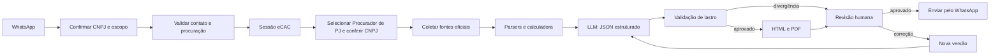

# Arquitetura do diagnóstico fiscal pelo WhatsApp

> Atualização de 10/09/2026: o fluxo prioritário passou a executar no Mac da FS, usando o Claude e o certificado já utilizados pelo cliente. Consulte [a arquitetura Mac + WhatsApp](docs/ARQUITETURA-MAC-ECAC.md). As referências abaixo a execução do navegador na VPS descrevem a proposta anterior.

## Objetivo do comando

Mensagem esperada:

```text
Entre no eCAC e faça uma análise da empresa X, CNPJ 00.000.000/0000-00.
```

O agente confirma empresa, CNPJ e escopo. Depois da confirmação, executa a
coleta somente de leitura, estrutura as fontes, produz o diagnóstico no padrão
do parecer de referência, submete a minuta para revisão e envia o PDF pelo
WhatsApp.

O nome da empresa não basta para acessar dados fiscais. O CNPJ precisa vir na
mensagem ou ser escolhido em um cadastro já autorizado. Nunca se resolve uma
empresa apenas por semelhança de nome.

## Material existente que será reaproveitado

A pasta fornecida contém um pipeline funcional dividido em quatro partes:

1. `sessao.mjs`: mantém uma sessão autenticada e aceita intervenção humana no
   CAPTCHA;
2. `coletar.mjs` e `extratores/`: navegam no eCAC, e-Processo, Regularize e
   SISPAR e baixam as fontes oficiais;
3. `analisar.mjs` e `lib/parsers.mjs`: extraem números, datas e prazos por
   regras de código;
4. `diagnosticar.mjs` e `lib/relatorio.mjs`: pedem a análise textual a um LLM,
   conferem valores e geram o PDF.

O parecer de referência tem 11 páginas A4 e define a saída desejada: painel de
abertura com KPIs, economia, composição e desembolso; diagnóstico do passivo;
CAPAG, rating e cenários; urgências; recomendações; fundamentos; ressalvas e
conclusão.

Os testes do projeto fornecido dependem de documentos reais da pasta `out/`,
que não vieram no arquivo compactado. As rotinas básicas executam, mas a suíte
completa só poderá ser validada quando esses fixtures forem fornecidos ou
anonimizados.

## Separação de responsabilidades

| Componente | Responsabilidade | Usa LLM |
|---|---|---|
| Orquestrador WhatsApp | intenção, confirmação, estado e entrega | apenas para linguagem livre opcional |
| RPA Playwright | login, perfil, navegação e download | não |
| Parsers | valores, inscrições, datas, prazos e rating | não |
| Calculadora | totais, percentuais, parcelas e cenários | não |
| Analista | leitura do caso, riscos, teses, recomendações e redação | sim |
| Validador | confere números e campos contra `dados.json` | não |
| Gerador | HTML/CSS, gráficos e PDF | não |
| Revisor humano | aprovação técnica antes do envio final | não |

O LLM nunca acessa certificado, senha, token do WhatsApp ou cookie de sessão.
Ele recebe somente o dossiê textual e o JSON estruturado necessários à análise.

## Pipeline do job `diagnostico_fiscal`



### Fontes coletadas

- relatório de situação fiscal da Receita Federal;
- relatório consolidado da dívida ativa no Regularize;
- CAPAG e rating no SISPAR;
- negociações e extratos do SISPAR;
- processos digitais;
- comunicados e intimações, preferindo CSV nativo para prazos.

Arquivos vazios, páginas de erro, grades truncadas e coletas parciais viram
lacunas explícitas. Eles não podem ser tratados como fonte válida.

## Integração com LLM

O servidor terá um adaptador independente de fornecedor:

```text
LLM_PROVIDER=openai|anthropic
LLM_MODEL=<modelo configurado>
LLM_API_KEY_FILE=/run/secrets/llm/api-key
```

A requisição contém:

1. regras da skill de diagnóstico;
2. `dados.json`, fonte exclusiva de números e datas;
3. trechos relevantes do `dossie.md`, com proveniência;
4. schema JSON obrigatório para a resposta;
5. instrução de registrar lacunas e todas as derivações aritméticas.

A resposta do modelo nunca vai direto ao PDF. Primeiro passa por validação de
schema, conferência de CNPJ, datas, percentuais e valores monetários. Valores
derivados precisam declarar parcelas ou percentual e base de cálculo. Uma
divergência bloqueia o envio e abre revisão humana.

## Correções pelo WhatsApp

Cada relatório possui `analysis_id`, versão, hash das fontes e estado. Exemplo:

```text
Corrija o relatório 2026-0042: retire a recomendação de parcelamento e informe
que a receita de 2025 foi R$ 18 milhões.
```

O orquestrador responde com o que entendeu e pede confirmação. Depois:

1. preserva a versão anterior;
2. classifica cada correção como redação, dado cadastral, dado declarado pelo
   cliente ou alteração de fonte oficial;
3. rejeita alteração silenciosa de número extraído do eCAC;
4. registra informação fornecida pelo cliente como tal e inclui a ressalva;
5. chama o LLM com o JSON anterior, a correção confirmada e as fontes;
6. repete a conferência determinística;
7. gera PDF com nova versão e envia para aprovação.

Correções como “deixe o texto mais simples” podem ser automáticas. Mudança de
valor, prazo, tese jurídica ou recomendação exige aprovação do revisor da FS.

## Estados do processo

```text
recebido
aguardando_cnpj
aguardando_confirmacao
aguardando_login_humano
coletando
coleta_incompleta
analisando
validando
aguardando_revisao
aguardando_correcao
aprovado
enviando
concluido
falhou
```

O WhatsApp recebe atualizações somente em mudanças úteis: pedido aceito, login
humano necessário, coleta incompleta, minuta pronta, correção aplicada e PDF
enviado.

## Controles obrigatórios

- contato e CNPJ previamente autorizados;
- procuração válida para cada fonte consultada;
- operações do RPA restritas a consulta e download;
- CAPTCHA tratado por uma pessoa, sem tentativa de contorno;
- verificação do CNPJ ativo depois da troca de perfil;
- isolamento do certificado e dos tokens;
- trilha de auditoria com fonte, horário, versão e aprovador;
- retenção e exclusão programada dos documentos;
- PDF final identificado como minuta até aprovação da FS;
- nenhum protocolo, adesão, parcelamento, guia ou transmissão sem autorização
  específica para uma fase futura.

## Estado da implementação

1. O job `diagnostico_fiscal` e a interpretação da mensagem natural estão implementados.
2. O certificado da FS está instalado e validado somente no worker da VPS.
3. A troca para Procurador de Pessoa Jurídica valida o CNPJ solicitado.
4. Os coletores de Situação Fiscal e Relatório Consolidado da PGFN estão implementados.
5. A análise usa OpenAI com JSON estrito e fontes identificadas.
6. O gerador de PDF foi reproduzido no padrão azul-marinho e dourado e revisado visualmente.
7. A homologação real está aguardando resolução humana do hCaptcha exibido pelo e-CAC.
6. Adicionar revisão e correções versionadas pelo WhatsApp.
7. Homologar o fluxo completo com um CNPJ autorizado antes de liberar clientes.
