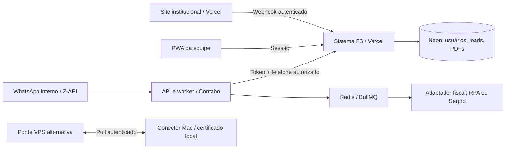

# Contexto consolidado — 16/09/2026

> Interface do acervo atualizada: análise primeiro, cabeçalho navy, arquivos agrupados por CNPJ com seletor/visualização de versões e sincronização automática em 15 segundos/foco. Ver `sistema-fs/docs/PARECER-REAL-SERPRO.md`.

> Atualização: parecer real FS emitido a partir das evidências Serpro já coletadas, com tela privada e PDF no mesmo template. Acervo diferencia parecer de documento de apoio. [Fluxo canônico](../sistema-fs/docs/PARECER-REAL-SERPRO.md). Novas consultas pelo PWA e emissão automática pelo worker ainda estão em homologação.

> Atualização posterior: consulta real SITFIS e Dívida Ativa homologada; PDF RFB disponível no acervo. Worker configurado, fila automática pausada e botão de nova análise ainda pendente. Ver [homologação Serpro](HOMOLOGACAO-SERPRO.md).

> Atualização: credenciais dos dois produtos Serpro recebidas e autenticação validada na VPS. Consultas reais ainda não homologadas. Ver [estado da integração Serpro](../automacao-ecac/docs/SERPRO-CREDENCIAIS-VALIDADAS.md); esta atualização substitui os trechos históricos que indicam ausência de contratação/chaves.

Este documento prevalece sobre descrições históricas de etapas anteriores. Ele registra o estado conhecido, não promete resultados fiscais nem substitui verificação do ambiente.

## Objetivo e experiência desejada

A FS quer analisar o CNPJ de uma empresa, visualizar os débitos/indicadores e emitir parecer em PDF no seu padrão. O sócio deve abrir o PWA de qualquer lugar e cair no Diagnóstico após o login. O agente WhatsApp é **interno**, para a equipe; não divulgar o número no site. Um pedido como “me manda a análise do cliente XPTO” deve recuperar o PDF já arquivado, sem pagar ou executar uma nova análise.

No site institucional, “Quero fazer meu diagnóstico” leva ao formulário. O servidor do site envia o lead ao sistema. A equipe encontra o contato em Comercial → Novos contatos; o modal oferece Dados, Diagnóstico e Anexos. O visitante não deve entrar no CRM interno.

## Decisões aceitas

- Sistema próprio Next.js, desenvolvimento em localhost:3100 e publicação na Vercel. Não usar Sites/Sites Hosting.
- Marca FS, topo navy, detalhes dourados e logo em `sistema-fs/public/brand/`.
- O PDF original `Parecer_SOSTributo_GPA_Construcoes.pdf` define a estrutura. Não substituir por um relatório resumido: abertura com indicadores, quatro partes e 17 seções. O caso/valores do modelo não são dados reutilizáveis nem regras tributárias universais.
- Login próprio substituiu o antigo HTTP Basic. O pedido anterior para retirar o popup não autoriza remover o login implementado depois.
- Z-API substitui Meta por configuração. As credenciais não pertencem ao frontend.
- Agente central na Contabo para processos contínuos; app/API/acervo na Vercel/Neon. Mac é alternativa para navegação com certificado local.
- Serpro foi estudado e possui adaptador SITFIS; contratação, credenciais, procurações e cobertura efetiva continuam pendentes. Não afirmar que CNPJ sozinho libera toda informação fiscal.

## Estado por componente

| Componente | Estado conhecido |
| --- | --- |
| Domínio app.fssolucoestributarias.com.br | Publicado, HTTPS e testes de acesso concluídos |
| Login | Better Auth 1.7.5, PostgreSQL, cookies HttpOnly/Secure, sessões 7 dias, rate limit persistente, cadastro público desativado |
| PWA | Manifesto e instalação, abre `/diagnostico`; offline guarda somente ícones e página genérica, sem relatórios |
| Comercial | Webhook persistente/idempotente, leads PostgreSQL, modal e anexos |
| Demais áreas de gestão | Telas de demonstração; não presumir módulos de negócio completos |
| Diagnóstico | Template/tela/PDF demonstrativos; `POST /api/diagnosticos` ainda devolve `503 PROVIDER_NOT_READY` |
| Parecer do sistema | Exemplo de 11 páginas, 4 partes/17 seções, cálculo compartilhado HTML/PDF |
| Acervo | PDFs do CRM + `fs_documents`, busca por nome/CNPJ, auditoria e API privada do agente |
| Recuperação pelo agente | Implementada em `automacao-ecac/src/system/documents.ts`; testes simulados e API de produção validados |
| WhatsApp real | Última verificação do worker central: `WHATSAPP_DRY_RUN=true`; não foi feito envio a pessoas nos testes |
| Provedor fiscal central | Última verificação: `FISCAL_DATA_PROVIDER=rpa`, `RPA_MODE=mock`; Serpro não ativado |
| Conector Mac/ponte | Código adicional encontrado na instalação local foi preservado em `conector-mac/`; homologação ponta a ponta e roteamento atual ainda precisam ser confirmados |

A documentação antiga do Mac registra bloqueios nos testes de 10–13/09. Comentários do conector posterior relatam login em 14/09. Essa divergência não comprova coleta/parecer real completo. Não repetir como fato verificado nesta migração; testar a instalação do novo Mac com autorização e intervenção humana quando necessária.

## Fluxos de dados

O diagrama distingue o caminho central e a ponte alternativa. O callback Z-API ativo deve ser inspecionado antes de qualquer mudança: evitar entregar o mesmo evento aos dois processadores e gerar consultas/envios duplicados.

## Acervo e limites importantes

- CRM: `fs_crm_leads`, `fs_crm_attachments`. Acervo adicional: `fs_documents`. Auditoria: `fs_document_audit`. Usuários/sessões: `fs_auth_*`.
- PDFs armazenados em PostgreSQL nesta fase, limite 3 MB. Antes de aumentar, implementar armazenamento privado de objetos.
- `GET /api/agent/documents?q=...`, `GET /api/agent/documents/:id`, `POST /api/agent/documents` (multipart) exigem token e `x-fs-requester-phone` autorizado.
- Arquivamento idempotente por protocolo; mesmo protocolo com conteúdo diferente gera conflito.
- Busca de nome ambíguo pede CNPJ. Falha/ausência de documento não dispara análise. O worker arquiva novos PDFs reais antes da entrega; mock não deve entrar como real.
- Falha no arquivamento preserva o arquivo no agente e interrompe a tarefa; reconciliar pelo protocolo, não repetir consulta fiscal cobrada.
- Não há segregação de acervo por cliente final: contas atuais são da equipe interna. Antes de abrir a clientes, implementar permissões por empresa.
- Nenhuma análise fica “atualizada” só porque foi reenviada. Mostrar origem/data/versão do arquivo.

## Parecer e origem fiscal

Ver `sistema-fs/docs/PARECER-TEMPLATE.md`. Valores monetários são centavos; bases RFB e PGFN separadas; ausência de fonte não significa zero. Simulação exige composição e parâmetros. A LLM interpreta evidências; totais, descontos e parcelas são calculados em código. CAPAG, dados contábeis, jurídicos e enquadramento não devem ser inventados.

O caminho RPA solicitado: e-CAC → Gov.br → certificado → alterar perfil → procurador de pessoa jurídica/CNPJ → situação fiscal/PDF; depois Dívida Ativa → Regularize → relatório consolidado detalhado/PDF. Validar CNPJ/perfil antes da coleta. Não prosseguir automaticamente em sessão bloqueada nem tratar sucesso de importação do PFX como login confirmado.

## Próximos passos, em ordem

1. Recuperar acesso às contas Vercel/GitHub/Neon e segredos; iniciar desenvolvimento em banco isolado.
2. Confirmar usuários internos e números autorizados de Fernando/equipe. Não assumir a identidade de um número só porque já está na allowlist.
3. Inspecionar callback da Z-API e definir responsável único por mensagens: API central ou ponte Mac.
4. Homologar recuperação de parecer real autorizado pelo WhatsApp, com modo de teste até a validação final.
5. Concluir provedor fiscal real (Serpro contratado ou conector Mac homologado), evidências, permissões e geração pelo serviço comum.
6. Ligar `POST /api/diagnosticos` ao job real com estados, falhas, histórico e revisão; manter amostra separada.
7. Unificar renderer/template do worker central, do pipeline Mac e do sistema. Há implementações distintas; somente o template do sistema foi validado em 11 páginas no último ajuste.
8. Evoluir correções/versionamento e revisão técnica; demais módulos depois.

## Verificações anteriores

Login/logout/revogação, rejeição de sessão forjada, cadastro fechado, API/PDF privados, manifesto PWA, busca do agente e bloqueio de telefone não autorizado passaram no domínio novo em 16/09. O banco contém um contato fictício rotulado `HOMOLOGAÇÃO FS · Teste de integração`. Não apresentá-lo como cliente real.

Os estudos Serpro em `automacao-ecac/docs/ESTUDO-SERPRO-2026-09-15.md` são pesquisa datada. Conferir preços, cobertura e regras oficiais antes de contratação; não assumir orçamento fixo com base neste snapshot.
